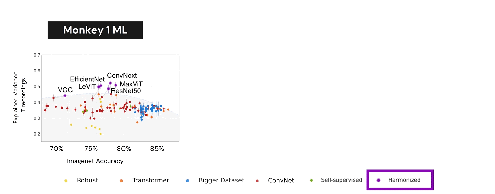

# Results

DNNs trained on ImageNet face a trade-off between achieving high object recognition
accuracy and predicting responses to natural images in IT. We measured the accuracy of 135
DNNs at predicting image-evoked responses from neurons in posterior lateral (PL) and medial-
lateral (ML) areas of IT by computing the neural predictivy of each model with the Brain-Score
evaluation method. DNN neural predictivity is progressively worsening as models improve
on ImageNet. This problem can be partially fixed by training DNNs with the neural harmonizer,
which aligns their learned object representations with humans. Error bars denote 95% bootstrapped
confidence intervals.

## Harmonized models are more interpretable! 

We used [CRAFT](https://arxiv.org/abs/2211.10154) (Concept Recursive Activation Factorization) To find the concepts that are more important to make a decision. Harmonized models provide more stable concepts and interpretable concepts than non harmonized models. 

